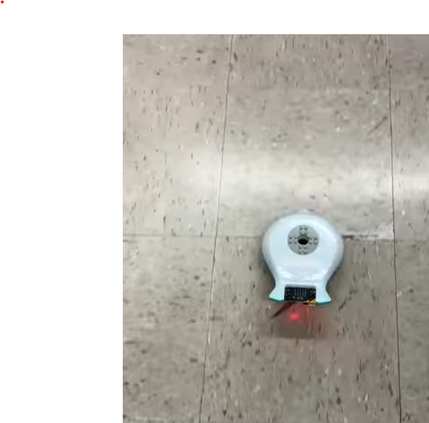

# Final Project: Finch Robot Challenges

## Essential Question
How can we apply object-oriented programming principles and Java concepts to create interactive, autonomous robot behaviors that solve real-world challenges?

## Project Overview
In this project-based learning experience, you will program a Finch 2.0 robot to perform one of three challenges:
1. Choreograph a dance routine (with movement, lights, and sound)
2. Create an artistic drawing using the robot's movements
3. Navigate a maze autonomously

Your program must demonstrate your understanding of Java programming concepts from APCSA and object-oriented design principles while creating an engaging robot behavior.

## Learning Objectives
- Apply Java programming concepts in a physical computing context
- Implement object-oriented design principles
- Develop problem-solving skills through algorithm development
- Create well-documented and maintainable code
- Practice technical communication through presentations and documentation

## Description of design choices

- My original plan was to make an algorithm that would go through the maze, without hard-coding
- However, this was deemed to be hard
- So, I switched to a square dance that would light up the tail and play notes while the display lit up

## Challenges faced and solutions

- The original challenge was with the maze as there were tiny issues when making the robot move a specific amount
- Additionally, if it was in between a wall, the sensors would be thrown off
- After changing to the dance, there were no issues and I continued to add parts to the dance

## Future enhancements

- I would add more dance moves
- Or I would attempt the maze once more and have it dance at the end

## Video

[Final Finch Video](https://youtube.com/shorts/Wg4DCdOZnpQ)